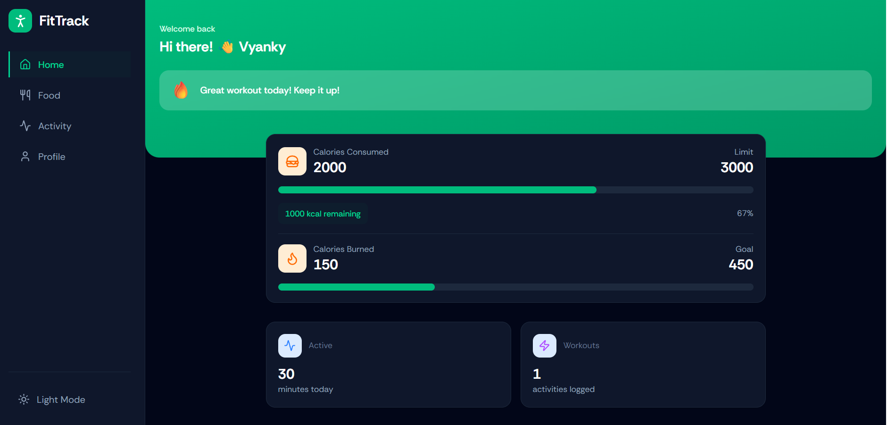
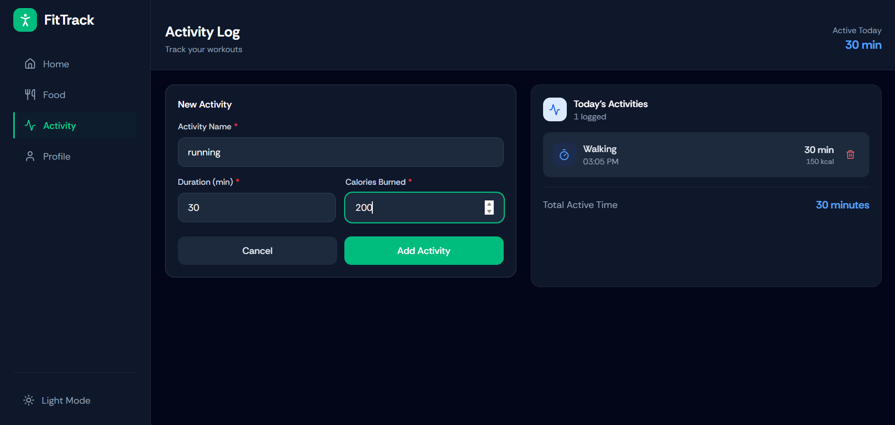
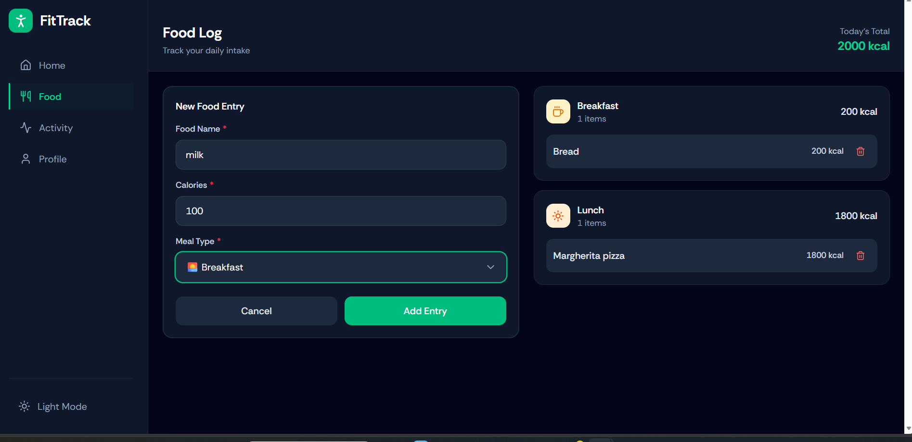
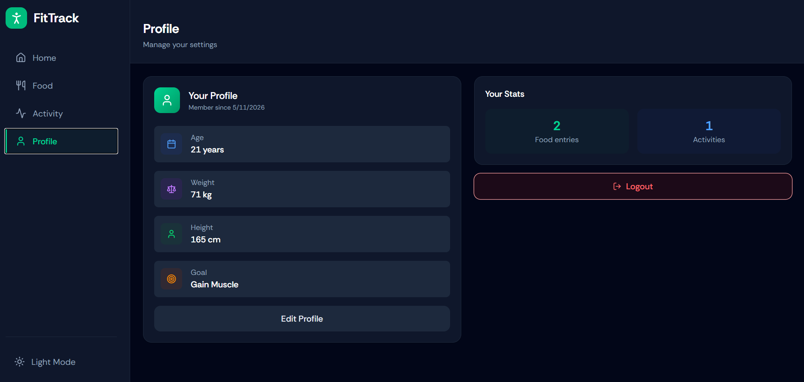

# Fitness Tracker Web Application

A modern full-stack Fitness Tracker Web Application built using React, TypeScript, Tailwind CSS, and Strapi. The application helps users monitor their fitness activities, track food intake, and visualize progress through interactive charts and dashboards.

---

## 🚀 Live Demo

🔗 Live Website: [https://fitness-tracker-client-olive.vercel.app/]

---

## 📌 Features

- User Authentication System
- Fitness Activity Tracking
- Food Logging System
- Interactive Dashboard
- Progress Charts & Analytics
- Responsive User Interface
- Backend CMS using Strapi
- Stripe Payment Integration
- Mobile-Friendly Design

---

## 🛠️ Tech Stack

### Frontend
- React
- TypeScript
- Tailwind CSS
- Vite
- React Router DOM
- Axios
- Recharts

### Backend
- Strapi CMS
- Node.js

### Database
- SQLite

### Deployment
- Vercel

### Payment Gateway
- Stripe

---

## 📂 Project Structure

```

Fitness_Tracker/
│
├── client/        # Frontend Application
├── server/        # Strapi Backend
└── README.md

````

---

## ⚙️ Installation & Setup

### 1️⃣ Clone the Repository

```bash
git clone [Add Your Repository Link Here]
````

```bash
cd Fitness_Tracker
```

---

## 🔹 Frontend Setup

```bash
cd client
npm install
npm run dev
```

Frontend will run on:

```bash
http://localhost:5173
```

---

## 🔹 Backend Setup

Open a new terminal:

```bash
cd server
npm install
npm run develop
```

Backend will run on:

```bash
http://localhost:1337
```

---

## 🔐 Environment Variables

Create a `.env` file inside the client folder and add:

```env
VITE_API_URL=YOUR_BACKEND_URL
VITE_STRIPE_PUBLIC_KEY=YOUR_STRIPE_PUBLIC_KEY
```

Create a `.env` file inside the server folder and add:

```env
STRIPE_SECRET_KEY=YOUR_SECRET_KEY
APP_KEYS=YOUR_APP_KEYS
API_TOKEN_SALT=YOUR_API_TOKEN_SALT
ADMIN_JWT_SECRET=YOUR_ADMIN_JWT_SECRET
JWT_SECRET=YOUR_JWT_SECRET
```

---

## 📊 Dashboard Features

* Daily Activity Tracking
* Calories Monitoring
* Food Log Management
* Progress Visualization
* User Profile Management

---

## 🌐 Deployment

### Frontend Deployment

The frontend is deployed using Vercel.

### Backend Deployment

The backend can be deployed using Strapi Cloud or any Node.js hosting platform.

---

## 📷 Screenshots

### 🏠 Home Page


### 📊 Activity Dashboard


### 🍔 Food Log Page


### 👤 Profile Page



## 📚 Learning Outcomes

This project helped in improving:

* Full Stack Development Skills
* React & TypeScript Concepts
* API Handling
* Authentication Flow
* CMS Integration
* Deployment Workflow
* Payment Gateway Integration

---

## 🤝 Contributing

Contributions, issues, and feature requests are welcome.

---

## 📧 Contact

Name: Vyankatesh Kulkarni

LinkedIn: [https://www.linkedin.com/in/vyankatesh-kulkarni-73906137b/]

GitHub: [https://github.com/Vyankatesh644]

---

## ⭐ Support

If you like this project, give it a star ⭐ on GitHub.

```
```
